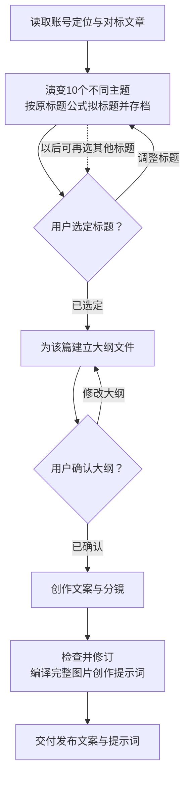

```mermaid
flowchart TD
    A[读取账号定位与对标文章] --> B[演变10个不同主题<br/>按原标题公式拟标题并存档]
    B --> C{用户选定标题？}
    C -- 调整标题 --> B
    C -- 已选定 --> D[为该篇建立大纲文件]
    D --> E{用户确认大纲？}
    E -- 修改大纲 --> D
    E -- 已确认 --> F[创作文案与分镜]
    F --> G[检查并修订<br/>编译完整图片创作提示词]
    G --> H[交付发布文案与提示词]
    B -. 以后可再选其他标题 .-> C
```

- 标题确认前不写大纲；大纲确认前不写正文或提示词。
- 一个对标保留一份标题库，可衍生多篇独立文章，不覆盖旧稿。
- 检查由AI内部完成；只交付提示词，不生图、不要求回传。
